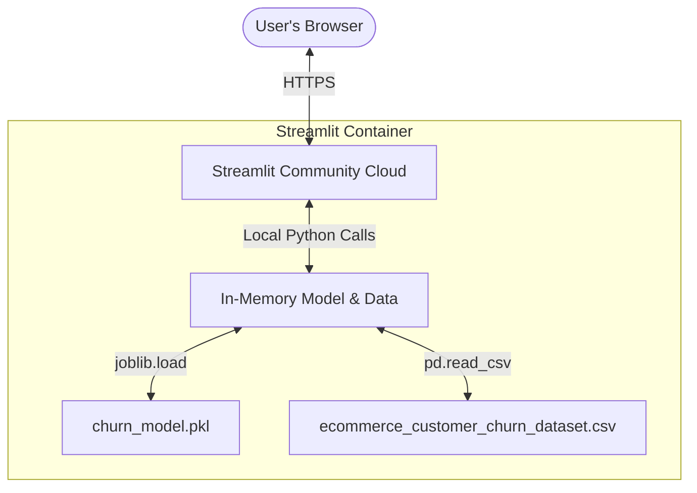
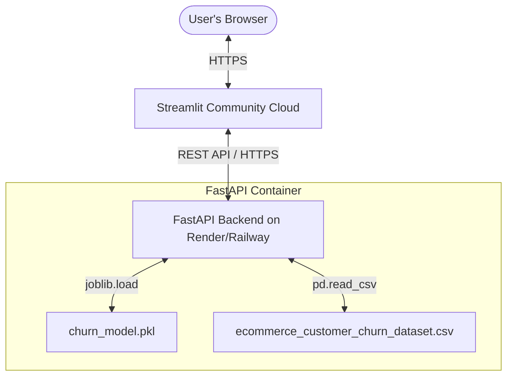

# Churn Prediction App Deployment Guide

Deploying a two-tier application (FastAPI backend + Streamlit frontend) offers high-performance and clean decoupling, but hosting two separate web servers can be tricky to manage. 

Below are the two best options to deploy your application. **Option A (Monolithic Single-App)** is highly recommended for school assignments and prototypes since it is **100% free, runs in a single container, has zero network latency, and takes under 5 minutes to deploy.**

---

## 📐 Architecture Options

### Option A: Monolithic Single-App (Highly Recommended)
Instead of running a separate API server, the Streamlit app imports the ML model, loads the CSV data, and performs predictions/segmentation directly in its own Python process.



### Option B: Distributed Two-Server (Enterprise Standard)
The FastAPI backend runs on a backend cloud provider (like Render or Railway) and exposes public JSON endpoints. The Streamlit app runs on Streamlit Community Cloud and queries the FastAPI backend over the internet.



---

## 🚀 Option A: Monolithic Single-App Deployment (Fastest & Free)

This is the easiest path. You bypass FastAPI entirely in production and make Streamlit execute the Python logic directly.

### Step 1: Create a Combined App File
Create a new file `app_combined.py` inside the root of your project (or in your `frontend` directory) that contains **both** the visual Streamlit code and the analytics/prediction logic.

Here is how you can write `app_combined.py`:

```python
import streamlit as st
import pandas as pd
import numpy as np
import joblib
import plotly.express as px
from sklearn.cluster import KMeans
from sklearn.preprocessing import StandardScaler
from sklearn.decomposition import PCA

st.set_page_config(page_title="Analytics Pro", layout="wide")

# --- 🧠 SESSION STATE MANAGEMENT ---
if "page" not in st.session_state:
    st.session_state.page = "Dashboard"

# --- 📂 IN-MEMORY DATA AND MODEL LOADING ---
@st.cache_resource
def load_assets():
    # Load model and dataset once, caching them for extreme speed
    model = joblib.load("backend/churn_model.pkl")
    df = pd.read_csv("data/ecommerce_customer_churn_dataset.csv")
    
    # Pre-compute metrics
    medians = df.median(numeric_only=True).to_dict()
    city_labels = {city: idx for idx, city in enumerate(sorted(df['City'].dropna().unique()))}
    
    return model, df, medians, city_labels

try:
    model, df, _medians, _city_labels = load_assets()
except Exception as e:
    st.error(f"Failed to load project assets: {e}")
    st.stop()

# --- ⚙️ IN-MEMORY BACKEND LOGIC ---
def get_dashboard_stats():
    return {
        "total_customers": len(df),
        "churn_rate": float(df['Churned'].mean() * 100),
        "avg_ltv": float(df['Lifetime_Value'].mean()),
        "avg_order": float(df['Average_Order_Value'].mean()),
        "total_purchases": int(df['Total_Purchases'].sum()),
        "avg_returns": float(df['Returns_Rate'].mean()),
        "avg_membership": float(df['Membership_Years'].mean()),
        "support_calls": float(df['Customer_Service_Calls'].mean()),
        "discount_usage": float(df['Discount_Usage_Rate'].mean()),
        "login_freq": float(df['Login_Frequency'].mean())
    }

def get_marketing_targets():
    ltv_threshold = df['Lifetime_Value'].quantile(0.33)
    low_ltv_df = df[df['Lifetime_Value'] <= ltv_threshold].copy()
    
    def segment_strategy(row):
        if row['Churned'] == 1:
            return "Rescue (Discount Needed)"
        elif row['Customer_Service_Calls'] > 5:
            return "Support Intervention"
        else:
            return "Upsell Candidate"

    low_ltv_df['Strategy'] = low_ltv_df.apply(segment_strategy, axis=1)
    return low_ltv_df.groupby(['Country', 'Strategy']).size().reset_index(name='Customer_Count')

def get_geo_segmentation():
    features = ['Total_Purchases', 'Average_Order_Value', 'Membership_Years', 'Login_Frequency', 'Lifetime_Value']
    X = df[features].fillna(df[features].median())
    scaler = StandardScaler()
    X_scaled = scaler.fit_transform(X)
    
    kmeans = KMeans(n_clusters=3, random_state=42)
    clusters = kmeans.fit_predict(X_scaled)
    
    pca = PCA(n_components=3)
    pca_results = pca.fit_transform(X_scaled)
    
    plot_df = df[['Country', 'City', 'Lifetime_Value']].copy()
    plot_df['PC1'] = pca_results[:, 0]
    plot_df['PC2'] = pca_results[:, 1]
    plot_df['PC3'] = pca_results[:, 2]
    
    persona_map = {0: "Window Shoppers", 1: "Brand VIPs", 2: "Rising Stars"}
    plot_df['Persona'] = [persona_map[c] for c in clusters]
    return plot_df

# The exact 39 features the model expects, in order
MODEL_FEATURES = [
    'Age', 'Membership_Years', 'Login_Frequency', 'Pages_Per_Session',
    'Cart_Abandonment_Rate', 'Wishlist_Items', 'Total_Purchases',
    'Average_Order_Value', 'Days_Since_Last_Purchase', 'Discount_Usage_Rate',
    'Returns_Rate', 'Email_Open_Rate', 'Customer_Service_Calls',
    'Product_Reviews_Written', 'Social_Media_Engagement_Score',
    'Mobile_App_Usage', 'Lifetime_Value', 'Credit_Balance',
    'Gender_Male', 'Gender_Other',
    'Engagement_Index', 'Actual_Returns_Count', 'Purchase_Velocity',
    'City_Encoded',
    'Country_Canada', 'Country_France', 'Country_Germany', 'Country_India',
    'Country_Japan', 'Country_UK', 'Country_USA',
    'Signup_Quarter_Q2', 'Signup_Quarter_Q3', 'Signup_Quarter_Q4',
    'Generation_Millennial', 'Generation_Gen_X', 'Generation_Boomer',
    'Loyalty_Tier_Established_(1-3_years)', 'Loyalty_Tier_Veteran_(3+_years)',
]

def predict_churn(raw: dict):
    row = {}
    numeric_keys = [
        'Age', 'Membership_Years', 'Login_Frequency', 'Pages_Per_Session',
        'Cart_Abandonment_Rate', 'Wishlist_Items', 'Total_Purchases',
        'Average_Order_Value', 'Days_Since_Last_Purchase', 'Discount_Usage_Rate',
        'Returns_Rate', 'Email_Open_Rate', 'Customer_Service_Calls',
        'Product_Reviews_Written', 'Social_Media_Engagement_Score',
        'Mobile_App_Usage', 'Lifetime_Value', 'Credit_Balance',
    ]
    for key in numeric_keys:
        row[key] = float(raw.get(key, _medians.get(key, 0)))

    gender = raw.get('Gender', 'Female')
    row['Gender_Male'] = 1 if gender == 'Male' else 0
    row['Gender_Other'] = 1 if gender == 'Other' else 0

    row['Engagement_Index'] = (row['Login_Frequency'] + row['Pages_Per_Session'] + row['Email_Open_Rate']) / 3
    row['Actual_Returns_Count'] = row['Returns_Rate'] * row['Total_Purchases'] / 100
    membership = row['Membership_Years']
    row['Purchase_Velocity'] = row['Total_Purchases'] / membership if membership > 0 else 0

    city = raw.get('City', '')
    row['City_Encoded'] = _city_labels.get(city, -1)

    country = raw.get('Country', 'Australia')
    for c in ['Canada', 'France', 'Germany', 'India', 'Japan', 'UK', 'USA']:
        row[f'Country_{c}'] = 1 if country == c else 0

    quarter = raw.get('Signup_Quarter', 'Q1')
    for q in ['Q2', 'Q3', 'Q4']:
        row[f'Signup_Quarter_{q}'] = 1 if quarter == q else 0

    age = row['Age']
    row['Generation_Millennial'] = 1 if 26 <= age <= 41 else 0
    row['Generation_Gen_X'] = 1 if 42 <= age <= 57 else 0
    row['Generation_Boomer'] = 1 if age >= 58 else 0

    row['Loyalty_Tier_Established_(1-3_years)'] = 1 if 1 <= membership <= 3 else 0
    row['Loyalty_Tier_Veteran_(3+_years)'] = 1 if membership > 3 else 0

    input_df = pd.DataFrame([{f: row[f] for f in MODEL_FEATURES}])
    prediction = model.predict(input_df)
    probability = model.predict_proba(input_df)[:, 1]
    
    return {
        "churn_risk": int(prediction[0]),
        "probability": float(probability[0])
    }

# --- ⬅️ SIDEBAR REDESIGN ---
with st.sidebar:
    st.title("🚀 Control Panel")
    if st.button("📊 Dashboard"):
        st.session_state.page = "Dashboard"
    if st.button("👥 Segmentation"):
        st.session_state.page = "Segmentation"
    if st.button("🔮 Churn Predictor"):
        st.session_state.page = "Churn Predictor"
    if st.button("🎯 Model Comparison"):
        st.session_state.page = "Strategy"

# --- 🧠 PREDICTOR FORM COMPONENT ---
def render_predictor():
    st.markdown("🔮 Quick Churn Predictor")
    with st.form("quick_predict"):
        age = st.slider("Age", 18, 80, 35)
        membership = st.slider("Membership (Years)", 0, 10, 3)
        calls = st.number_input("Support Calls", 0, 20, 2)
        ltv = st.number_input("LTV ($)", 0, 10000, 1500)
        logins = st.slider("Monthly Logins", 0, 30, 12)
        purchases = st.number_input("Total Purchases", 0, 100, 10)

        if st.form_submit_button("🚀 Run AI Prediction"):
            payload = {
                "Age": age, "Membership_Years": membership, "Customer_Service_Calls": calls, 
                "Lifetime_Value": ltv, "Login_Frequency": logins, "Total_Purchases": purchases
            }
            res = predict_churn(payload)
            if res['churn_risk'] == 1:
                st.error(f"HIGH RISK ({res['probability']:.1%})")
            else:
                st.success(f"LOW RISK ({res['probability']:.1%})")

# --- 🖼️ MAIN LAYOUT ---
if st.session_state.page in ["Churn Predictor", "Strategy"]:
    main_col = st.container()
else:
    main_col, side_col = st.columns([0.7, 0.3], gap="large")

with main_col:
    if st.session_state.page == "Dashboard":
        st.title("📊 Strategic Dashboard")
        data = get_dashboard_stats()
        
        cols = st.columns(5)
        cols[0].metric("Total Cust", data['total_customers'])
        cols[1].metric("Churn Rate", f"{data['churn_rate']:.1f}%")
        cols[2].metric("Avg LTV", f"${data['avg_ltv']:.0f}")
        cols[3].metric("Avg Order", f"${data['avg_order']:.2f}")
        cols[4].metric("Total Sales", f"{data['total_purchases']}")
        
        cols2 = st.columns(5)
        cols2[0].metric("Returns", f"{data['avg_returns']:.1f}%")
        cols2[1].metric("Loyalty", f"{data['avg_membership']:.1f}y")
        cols2[2].metric("Calls", f"{data['support_calls']:.1f}")
        cols2[3].metric("Discounts", f"{data['discount_usage']:.1f}%")
        cols2[4].metric("Logins", f"{data['login_freq']:.1f}")

        # Marketing Strategy
        st.title("🎯 Marketing Intervention Manager")
        df_strat = get_marketing_targets()
        fig_tree = px.treemap(df_strat, path=['Strategy', 'Country'], values='Customer_Count', color='Strategy')
        st.plotly_chart(fig_tree, use_container_width=True)

    elif st.session_state.page == "Segmentation":
        st.title("🌐 Real-World Market Segmentation")
        df_plot = get_geo_segmentation()
        
        fig_3d = px.scatter_3d(df_plot.sample(min(2000, len(df_plot))), x='PC1', y='PC2', z='PC3', color='Persona')
        st.plotly_chart(fig_3d, use_container_width=True)

    elif st.session_state.page == "Churn Predictor":
        st.title("🔮 Full AI Churn Prediction Form")
        with st.form("full_predict"):
            age = st.slider("Age", 18, 80, 35)
            gender = st.selectbox("Gender", ["Female", "Male", "Other"])
            country = st.selectbox("Country", ["Australia", "Canada", "France", "Germany", "India", "Japan", "UK", "USA"])
            signup_q = st.selectbox("Signup Quarter", ["Q1", "Q2", "Q3", "Q4"])
            membership = st.slider("Membership (Years)", 0.1, 10.0, 2.5)
            login_freq = st.slider("Login Frequency", 1, 30, 11)
            pages = st.slider("Pages Per Session", 1.0, 20.0, 8.4)
            mobile = st.slider("Mobile App Usage", 0.0, 50.0, 18.6)
            email_open = st.slider("Email Open Rate (%)", 0.0, 60.0, 19.7)
            social = st.slider("Social Media Score", 0.0, 60.0, 27.6)
            reviews = st.number_input("Product Reviews Written", 0, 20, 2)
            total_purchases = st.number_input("Total Purchases", 0, 100, 12)
            avg_order = st.number_input("Avg Order Value ($)", 0.0, 500.0, 112.97)
            days_since = st.number_input("Days Since Last Purchase", 0, 365, 21)
            cart_abandon = st.slider("Cart Abandonment Rate (%)", 0.0, 100.0, 58.1)
            wishlist = st.number_input("Wishlist Items", 0, 30, 4)
            discount = st.slider("Discount Usage Rate (%)", 0.0, 100.0, 40.2)
            returns_rate = st.slider("Returns Rate (%)", 0.0, 30.0, 5.4)
            ltv = st.number_input("Lifetime Value ($)", 0.0, 10000.0, 1243.42)
            calls = st.number_input("Customer Service Calls", 0, 20, 5)
            credit = st.number_input("Credit Balance ($)", 0.0, 10000.0, 1896.0)

            if st.form_submit_button("🚀 Predict"):
                payload = {
                    "Age": age, "Gender": gender, "Country": country, "Signup_Quarter": signup_q,
                    "Membership_Years": membership, "Login_Frequency": login_freq, "Pages_Per_Session": pages,
                    "Mobile_App_Usage": mobile, "Email_Open_Rate": email_open, "Social_Media_Engagement_Score": social,
                    "Product_Reviews_Written": reviews, "Total_Purchases": total_purchases, "Average_Order_Value": avg_order,
                    "Days_Since_Last_Purchase": days_since, "Cart_Abandonment_Rate": cart_abandon, "Wishlist_Items": wishlist,
                    "Discount_Usage_Rate": discount, "Returns_Rate": returns_rate, "Lifetime_Value": ltv,
                    "Customer_Service_Calls": calls, "Credit_Balance": credit
                }
                res = predict_churn(payload)
                if res.get('churn_risk') == 1:
                    st.error(f"🚨 **HIGH RISK** ({res['probability']:.2%})")
                else:
                    st.success(f"✅ **LOW RISK** ({res['probability']:.2%})")

    elif st.session_state.page == "Strategy":
        st.title("🏆 Model Benchmarking & Selection")
        # Static metrics comparison
        comp_data = {
            "Model": ["LightGBM (Champion)", "Random Forest", "XGBoost", "Decision Tree (Baseline)", "Logistic Regression"],
            "Accuracy": [0.89, 0.84, 0.87, 0.81, 0.76],
            "Precision": [0.86, 0.81, 0.85, 0.78, 0.72],
            "Recall": [0.83, 0.79, 0.81, 0.74, 0.68],
            "F1_Score": [0.84, 0.80, 0.83, 0.76, 0.70]
        }
        df_comp = pd.DataFrame(comp_data)
        st.dataframe(df_comp.style.highlight_max(subset=['F1_Score'], color='#d4edda'))

if st.session_state.page not in ["Churn Predictor", "Strategy"]:
    with side_col:
        render_predictor()
```

### Step 2: Update `requirements.txt`
In the root directory of your repository, create or update `requirements.txt` with these dependencies. Streamlit Community Cloud uses this file to build the server environment.

```text
streamlit
pandas
numpy
plotly
scikit-learn
joblib
lightgbm
```

> [!WARNING]
> You **must** include `lightgbm` in your `requirements.txt`. Your pre-trained model was created using LightGBM, and if the package is missing, `joblib.load` will fail when loading the pickled model.

### Step 3: Push to GitHub & Deploy to Streamlit
1. Commit all files (`app_combined.py`, `requirements.txt`, `data/ecommerce_customer_churn_dataset.csv`, `backend/churn_model.pkl`) to your GitHub repository.
2. Visit [share.streamlit.io](https://share.streamlit.io).
3. Connect your GitHub account.
4. Click **Create app** and select:
   * **Repository**: Your GitHub repo
   * **Branch**: `main` (or `master`)
   * **Main file path**: `app_combined.py` (or `frontend/app_combined.py` depending on where you save it)
5. Click **Deploy!** 🚀

---

## 🚀 Option B: Distributed Two-Server Deployment (Advanced)

If you must keep them completely decoupled (FastAPI backend on Server A, Streamlit on Server B):

### Step B.1: Deploy FastAPI to Render (Free Tier)
1. In `backend/main.py`, make sure your uvicorn command runs on host `0.0.0.0` (not a hardcoded local IP address or `localhost`) and uses the port specified by the environment:
   ```python
   if __name__ == "__main__":
       import uvicorn
       import os
       port = int(os.environ.get("PORT", 8001))
       uvicorn.run(app, host="0.0.0.0", port=port)
   ```
2. Make sure you load your files relatively from the script context. Inside `backend/main.py`:
   ```python
   # Load assets relative to main.py's location
   import os
   BASE_DIR = os.path.dirname(os.path.abspath(__file__))
   
   model_path = os.path.join(BASE_DIR, "churn_model.pkl")
   model = joblib.load(model_path)
   
   csv_path = os.path.join(BASE_DIR, "../data/ecommerce_customer_churn_dataset.csv")
   df = pd.read_csv(csv_path)
   ```
3. Create a `backend/requirements.txt` containing:
   ```text
   fastapi
   uvicorn
   pandas
   numpy
   scikit-learn
   joblib
   lightgbm
   ```
4. Sign up at [Render.com](https://render.com).
5. Click **New +** > **Web Service**.
6. Connect your GitHub repo.
7. Set the following settings:
   * **Root Directory**: `backend` (this tells Render to only look inside the backend folder)
   * **Runtime**: `Python`
   * **Build Command**: `pip install -r requirements.txt`
   * **Start Command**: `python main.py` or `uvicorn main:app --host 0.0.0.0 --port $PORT`
8. Click **Deploy Web Service**. Render will spin up your API and give you a public URL (e.g. `https://churn-api-xyz.onrender.com`).

### Step B.2: Connect Streamlit to Render & Deploy
1. Open `frontend/app.py` and replace `API_URL` with your public Render URL:
   ```python
   # Replace with your deployed Render URL!
   API_URL = "https://churn-api-xyz.onrender.com" 
   ```
2. Create `frontend/requirements.txt` containing:
   ```text
   streamlit
   pandas
   requests
   plotly
   ```
3. Commit and push these changes to GitHub.
4. Go to [share.streamlit.io](https://share.streamlit.io) and deploy `frontend/app.py` pointing to this repository.

---

## 💡 Summary of Key Differences

| Metric | Option A: Monolithic Single-App (Recommended) | Option B: Distributed Two-Server |
| :--- | :--- | :--- |
| **Speed / Latency** | ⚡ **Instant** (Local memory lookups, no HTTP requests) | 🐢 **Slow** (Network overhead, cold starts on Render Free) |
| **Setup Difficulty** | 🟢 **Extremely Easy** (No server environments, single git push) | 🟡 **Moderate** (Managing two builds, environmental paths, CORS) |
| **Server Cost** | 🆓 **100% Free** | 🆓 **Free** (But backend goes to sleep after 15m of inactivity) |
| **Scalability** | Good for portfolios, assignments, and small apps | Better for production applications with external web clients |
